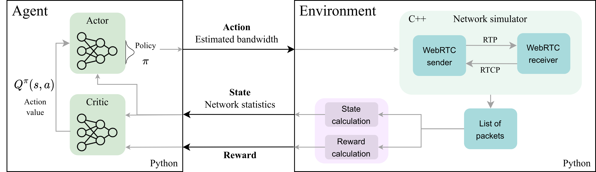

## About
**ReCoCo** is a Reinforcement-learning based Congestion Control algorithm for Real-time applications (video conferencing, cloud gaming).

## System overview

## Scripts
Here is an outline of the main scripts used to train and test the various models:
- *conf_dict_new*: configure all parameters to start training (e.g. number of timesteps, algorithm, saving paths and other parameters)
- *trace_lists*: specifies different groupings of traces in lists for easier use in the other scripts (e.g. norway_traces, ghent_traces, low_bandwidth_traces)

- *train_new_data*: reads the configuration from *conf_dict_new* and employs training
- *test_env*: employs testing - needs arguments (model type and episode number; e.g. random_low_bandwidth 80000) 
- *test_env_non_testable_traces*: test models without running GCC in parallel, for the traces that do not support GCC

- *rtc_env*: RL environment (exactly following Gym guidelines)

## Paper
If you use this code, please cite the following paper:

@inproceedings{markudova2023recoco,  
  title={ReCoCo: Reinforcement learning-based Congestion control for Real-time applications},  
  author={Markudova, Dena and Meo, Michela},  
  booktitle={2023 IEEE 24th International Conference on High Performance Switching and Routing (HPSR)},  
  pages={68--74},  
  year={2023},  
  organization={IEEE}  
}

